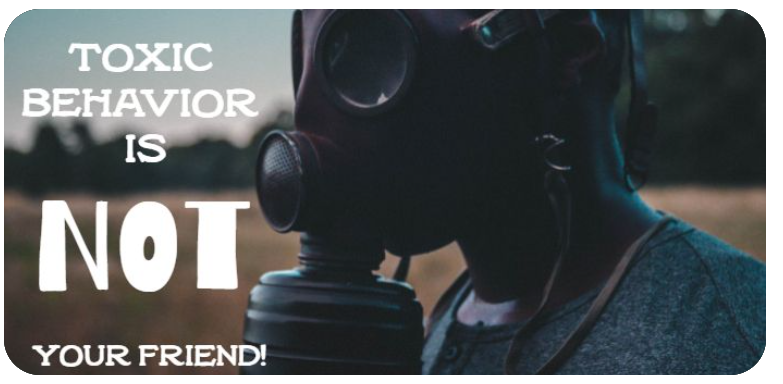
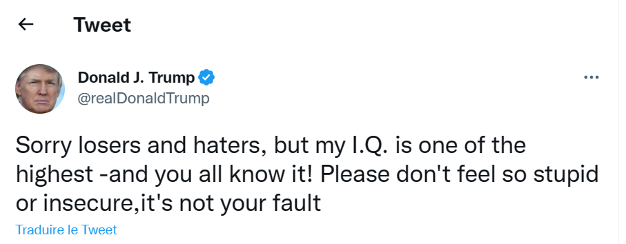

# Introduction

As reported by the [New York Times Magazine](https://www.nytimes.com/2017/08/03/magazine/for-the-new-far-right-youtube-has-become-the-new-talk-radio.htm) in 2017, YouTube has become "the new Conservative talk radio" for the far right. Moreover, in 2019, [Kevin Roose depicted ](https://www.nytimes.com/interactive/2019/06/08/technology/youtube-radical.html) "countless" stories of young men, looking for direction or distraction on YouTube, ending up "seduced by a community of far-right creators". The existence of a radicalization pipeline on Youtube was strongly suggested by the study [“Auditing Radicalization Pathways on Youtube”, by Ribeiro et al. (2020)](https://dlab.epfl.ch/people/west/pub/HortaRibeiro-Ottoni-West-Almeida-Meira_FAT-20.pdf). 
From there, we would like to enlarge the scope of this research by studying the toxicity of the comments and the co-commenting activities in far right channel videos. 

Doing so, we would like to see if these channels generate more toxic behavior and isolate users. Finally, this project could help find suitable solutions in order to reduce toxicity and attenuate far-right radicalization.

To study far-right wing channels on Youtube, our study will be based on the data and the results coming from Ribeiro et al. (2020) study. The studied channels are broadly classified into four types: Media (the control group), the Alt-lite, the Intellectual Dark Web (I.D.W) and the Alt-right. 

# Toxicity
## How to measure toxicity ?

[_Detoxify_](https://github.com/unitaryai/detoxify) is a machine learning model which rates the toxicity of a comment on a scale from 0 to 1 (0 not at all, 1 very much). Furthermore, it detects if it fits into these subcategories of toxicity: **severe_toxicity**, **obscene**, **identity_attack**, **insult**, **threat**, **sexual_explicit**. A comment is rated 1 in toxicity if it is a very ‘hateful, aggressive, or disrespectful that is very likely to make you leave a discussion or give up on sharing your perspective’. 

[include example of application of Detoxify, see notebook in to delete/toxic_examples.ipynb . Either include the table, or it would be fun to include “un curseur où l’utilisateur peut choisir le degré de toxiticité”. ]

<table>
    <tr>
        <td>Foo</td>
    </tr>
</table>

<label for="pet-select">Choose a pet:</label>
<select name="pets" id="pet-select">
    <option value="">--Please choose an option--</option>
    <option value="dog">Dog</option>
    <option value="cat">Cat</option>
</select>

## Process

    

    <a href="https://www.selfies.com/apps/instagram/
stay-toxic-lustiger-social-media-trend-tiktok-insta-beziehungstipps-141719/">Source</a>

    

    <a href="http://www.picturequotes.com/have-you-been-playing-in-toxic-waste-lately-quote-427713">Source</a>

    

    <a href="https://www.pinterest.fr/pin/551761391849970879/">Source</a>

## Introduction

Some extreme communities are well known for making toxic comments. Taking Trump for example:

    

    <a href="https://twitter.com/realDonaldTrump/status/332308211321425920">Twitter</a>

But how toxic is that tweet? Thankfully, we’re using a Machine Learning model called Detoxify to compute how toxic a sentence is and how severe-toxic, obscene, threatening, sexually explicit, identity attacking  and threatening it is. It rates it on a scale from 0 to 1 (0 not at all, 1 very). To get an idea, a comment is considered to have a toxicity of 1 if if it is a very ‘hateful, aggressive, or disrespectful that is very likely to make you leave a discussion or give up on sharing your perspective’. 
For example Trump’s tweet had a score of :

| Toxicity        | Severe toxicity  | Obscene  | Identity attack |  Insult  | Threat   | Sexual explicit |
|:----------------|:-----------------|:---------|:----------------|:---------|:-------- |:----------------|
|    0.994145     |     0.000396     | 0.004639 |     0.004734    | 0.988292 | 0.000295 |     0.000622    |

It has a toxicity of ~0.994 and is very insulting (insult~0.988). To get a better idea of what toxicity score is associated with what type of sentence, we’re introducing the monkey scale:
(scale of the monkey sequences and the corresponding monkey sentences)

>Toxicity of '_The monkey makes jokes_' 

| Toxicity        | Severe toxicity  | Obscene  | Identity attack |  Insult  | Threat   | Sexual explicit |
|:----------------|:-----------------|:---------|:----------------|:---------|:-------- |:----------------|
|    0.080424	  |     0.000012     | 0.000631 |     0.001699    | 0.045562 | 0.000297	|    0.000416     |

>Toxicity of 'The mean monkey makes means jokes about means' 

| Toxicity        | Severe toxicity  | Obscene  | Identity attack |  Insult  | Threat   | Sexual explicit |
|:----------------|:-----------------|:---------|:----------------|:---------|:-------- |:----------------|
|    0.158876	  |     0.000014	 | 0.000780 |     0.002192    | 0.123876 | 0.000231	|    0.000387     |

>Toxicity of '_The annoying monkey makes annoying jokes about means_',
'The vile monkey makes vile jokes about means' 

| Toxicity        | Severe toxicity  | Obscene  | Identity attack |  Insult  | Threat   | Sexual explicit |
|:----------------|:-----------------|:---------|:----------------|:---------|:-------- |:----------------|
|    0.197954	  |     0.000018	 | 0.001104 |     0.002104    | 0.139986 | 0.000289	|    0.000623     |

>Toxicity of '_The annoying monkey makes annoying jokes about means_',
'The vile monkey makes vile jokes about means' 

| Toxicity        | Severe toxicity  | Obscene  | Identity attack |  Insult  | Threat   | Sexual explicit |
|:----------------|:-----------------|:---------|:----------------|:---------|:-------- |:----------------|
|    0.197954	  |     0.000018	 | 0.001104 |     0.002104    | 0.139986 | 0.000289	|    0.000623     |

>Toxicity of '_The malevolent monkey makes malevolent jokes about means_',
'The vile monkey makes vile jokes about means' 

| Toxicity        | Severe toxicity  | Obscene  | Identity attack |  Insult  | Threat   | Sexual explicit |
|:----------------|:-----------------|:---------|:----------------|:---------|:-------- |:----------------|
|    0.319232	  |     0.000017	 | 0.000790 |     0.002627    | 0.259821 | 0.000322	|    0.000463     |

